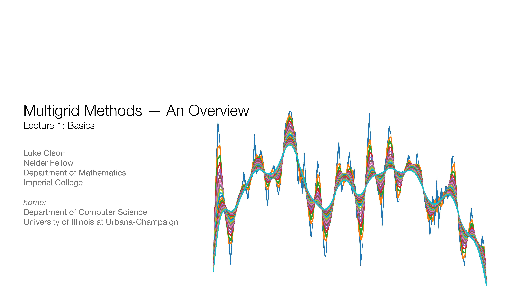
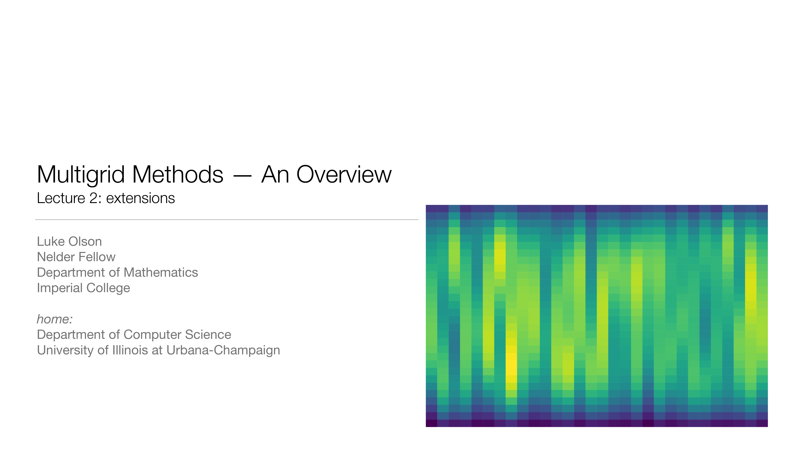
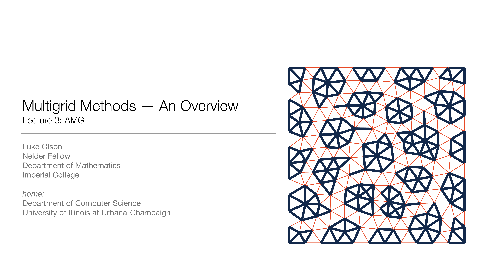
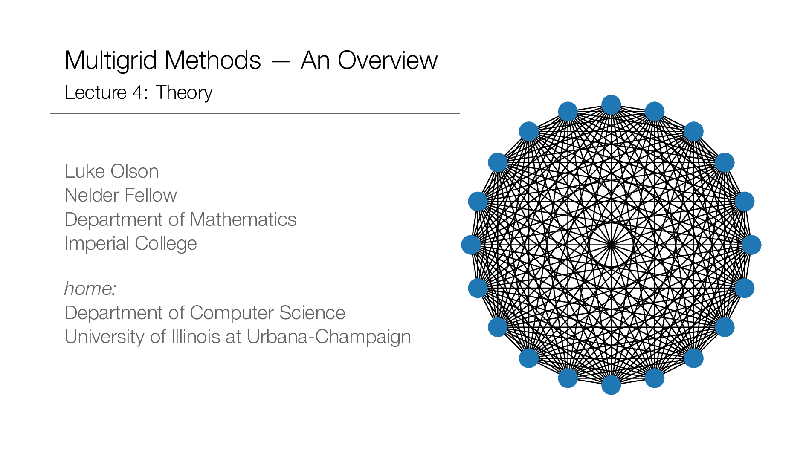
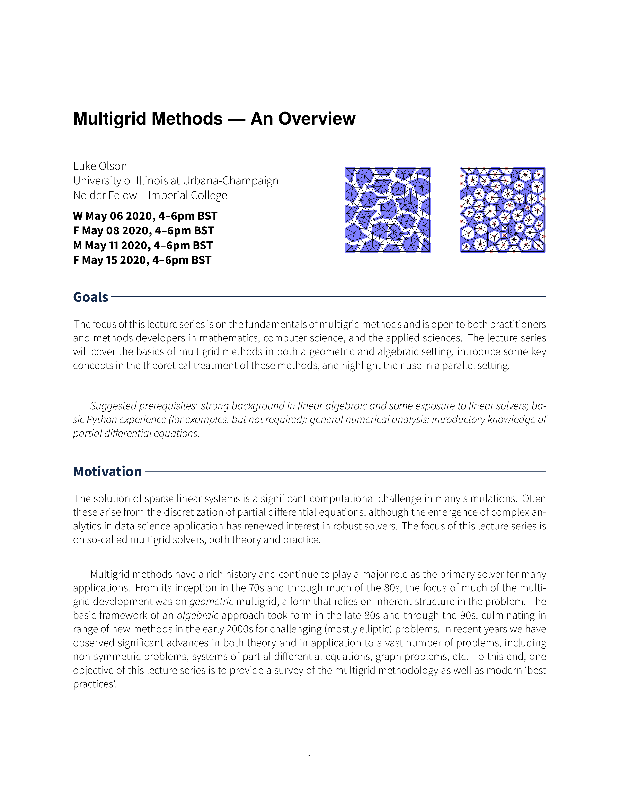
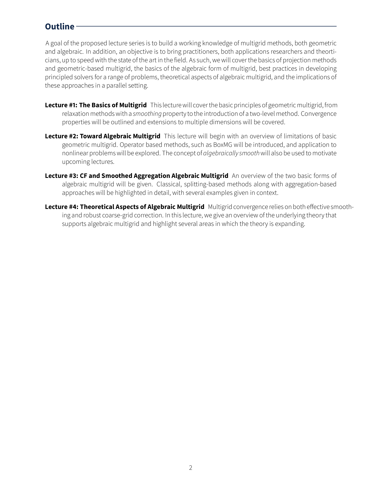

### Multigrid Methods - An Overview

#### A (virtual!) Lecture Series at Imperial College
Luke Olson, University of Illinois at Urbana Champaign

- **W May 06 2020, 4--6pm BST** [Lecture 1: MG Basics](https://github.com/lukeolson/imperial-multigrid/blob/master/lecture-1-mg-basics/lecture-1-mg-basics.pdf)
- **F May 08 2020, 4--6pm BST** [Lecture 2: MG Extensions](https://github.com/lukeolson/imperial-multigrid/blob/master/lecture-2-mg-ext/lecture-2-mg-basics.pdf)
- **M May 11 2020, 4--6pm BST** [Lecture 3: Algebraic Multigrid (AMG)](https://github.com/lukeolson/imperial-multigrid/blob/master/lecture-3-amg-basics/lecture-3-amg-basics.pdf)
- **F May 15 2020, 4--6pm BST** [Lecture 4: Multigrid Theory](https://github.com/lukeolson/imperial-multigrid/blob/master/lecture-4-amg-theory/lecture-4-amg-theory.pdf)

<table>
  <tr>
    <td> 
         </td>
    <td> 
    </td>
   </tr> 
   <tr>
     <td> 
     </td>
     <td> 
     </td>
  </tr>
</table>

Participation will be via zoom.

The focus of this lecture series is on the fundamentals of multigrid methods
and is open to both practitioners and methods developers in mathematics, computer
science, and the applied sciences. The lecture series will cover the basics of
multigrid methods in both a geometric and algebraic setting, introduce some key
concepts in the theoretical treatment of these methods, and highlight their use
in a parallel setting.

*Suggested prerequisites: strong background in linear algebra and some
exposure to linear solvers; basic Python experience (for examples, but not
required); general numerical analysis; introductory knowledge of partial
differential equations.*

---

